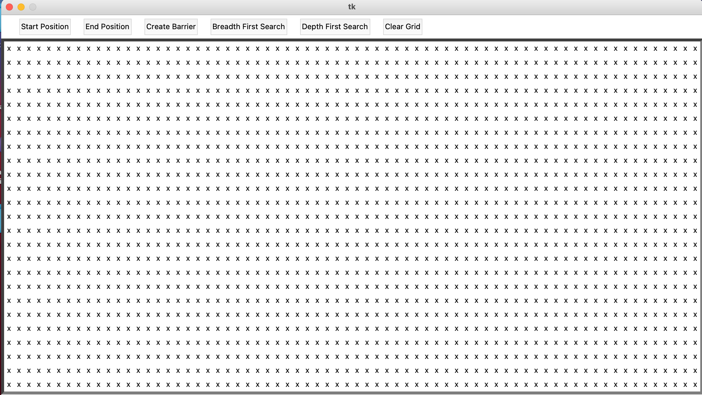
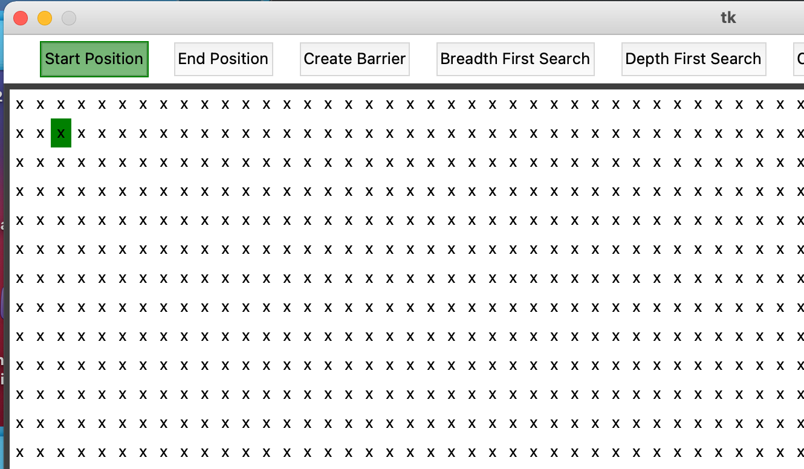
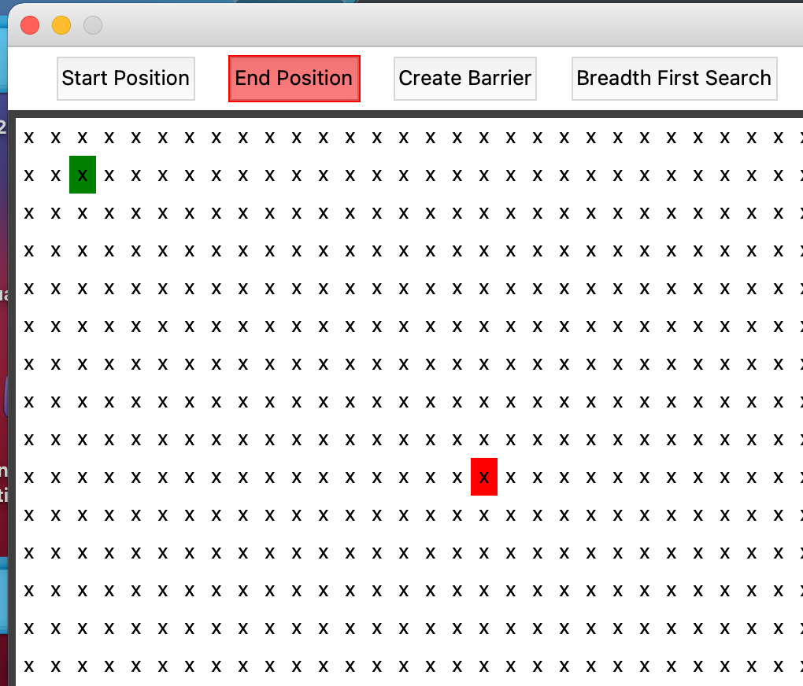
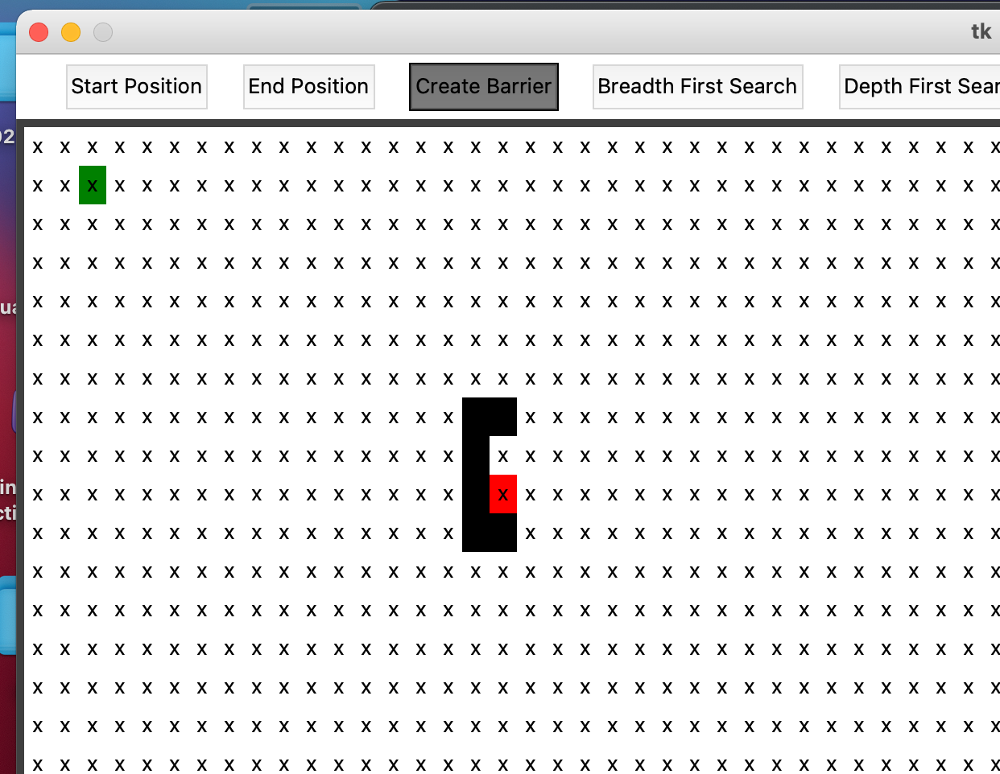
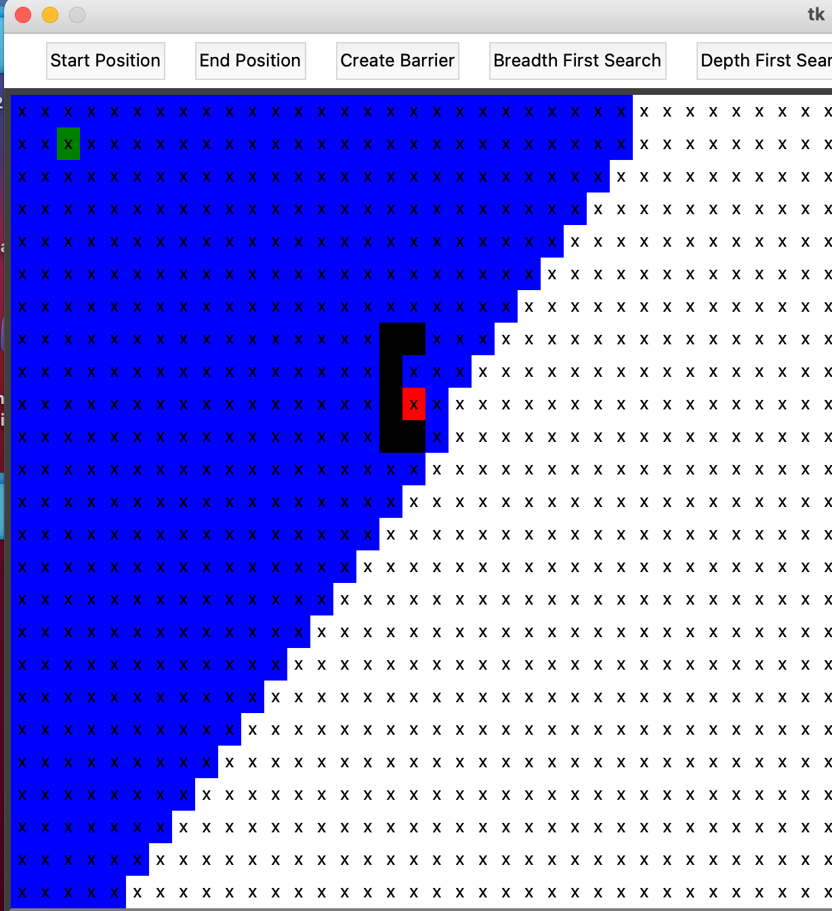

# Maze Hunter

A visual representation of a grid search using Python3 and Tkinter. Select a start position in green, an end position in red, and place any barriers directly on the screen. There is a choice between two search algorithms at the moment Breadth First Search (BFS) and Depth First Search (DFS). Choosing one or the other will activate the search and the nodes explored will be highlighted in blue.

Since I'm a TA for data structures I wanted to make something visually that could demonstrate the two most common graph search algorithms, while leaving room for expansion. I also wanted to challenge myself by creating a GUI and linking it to a backend.

In the future I want to add more graphing algorithms, add a weights option to the grid, and have a shortest route path visually shown after the graph finds the end point.

## Installation

All that is needed are the gui.py and mazeHunter.py files in the same source folder and run the gui.py file.

```
python3 gui.py
```

## Usage

Once you run the gui.py the gui will load.




You select the start position by activating the start button and double clicking on the grid where you want to start. It does not allow duplicate starts, does not overwrite the end or barriers, and double clicking on the current start position will remove it.



Select the end position by activating the end button and double clicking on where the end should be. It does not allow duplicate ends,
does not overwrite the start or barriers, and double clicking on the current end position will remove it.



Place barriers around the grid for the algorithm to navigate by activating the barrier button and double clicking on empty spots on the grid. You can place as many barriers as you want. To remove a barrier double click on the barrier while the barrier button is activated.



Press the button for the algorithm you want to explore the grid and then after a moment it will search for the end. Any square highlighted in blue is a visited node.



